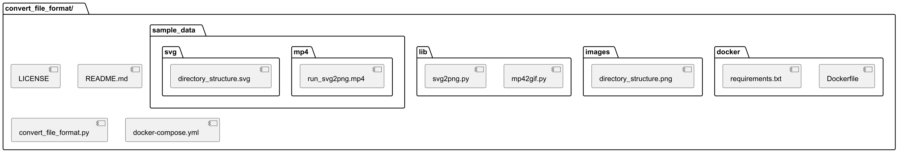

# Convert File Format

This program convers the file format.

## Support

- svg -> png
- mp4 -> gif
- png -> ico
- png -> svg

## Prepare

```
$ docker-compose build
$ docker-compose up -d
$ docker-compose exec --user $UID convert_file_format bash
$ cd /work
```

### About ``libssl1``

``libssl1.0.0`` get from http://security.ubuntu.com/ubuntu/pool/main/o/openssl1.0/ .  
``docker-compose build`` may be failed by the version up.  
If nessesary, please update link in ``docker/Dockerfile``.

## Usage

```
$ python3 convert_file_format.py --help
usage: convert_file_format.py [-h] --convert_type {svg2png,mp42gif,png2ico,png2svg} --input_file INPUT_FILE
                              --output_file OUTPUT_FILE

Convert file format

options:
  -h, --help            show this help message and exit
  --convert_type {svg2png,mp42gif,png2ico,png2svg}
                        convert type
  --input_file INPUT_FILE
                        input file path
  --output_file OUTPUT_FILE
                        output file path
```

### SVG2PNG

```
$ python3 convert_file_format.py --convert_type svg2png --input_file <input_file> --output_file <output_file>
```

#### Output sample of ``./sample_data/svg/directory_structure.svg``



### MP42GIF

```
$ python3 convert_file_format.py --convert_type mp42gif --input_file <input_file> --output_file <output_file>
```

#### Output sample of ``./sample_data/mp4/run_svg2png.mp4``


### PNG2ICO

```
$ python3 convert_file_format.py --convert_type png2ico --input_file <input_file> --output_file <output_file>
```


### PNG2SVG

```
$ python3 convert_file_format.py --convert_type png2svg --input_file <input_file> --output_file <output_file>
```

## Modules and Licenses

```
$ pip-licenses
 Name                           Version   License
 Babel                          2.12.1    BSD License
 Jinja2                         3.1.2     BSD License
 MarkupSafe                     2.1.3     BSD License
 Pillow                         10.0.0    Historical Permission Notice and Disclaimer (HPND)
 PyGObject                      3.42.1    GNU Lesser General Public License v2 or later (LGPLv2+)
 Pygments                       2.15.1    BSD License
 Sphinx                         7.0.0     BSD License
 alabaster                      0.7.13    BSD License
 aspose-words                   23.6.0    Free To Use But Restricted; Other/Proprietary License
 certifi                        2023.5.7  Mozilla Public License 2.0 (MPL 2.0)
 charset-normalizer             3.2.0     MIT License
 cssselect2                     0.7.0     BSD License
 dbus-python                    1.2.18    MIT License
 docutils                       0.19      BSD License; GNU General Public License (GPL); Public Domain; Python Software Foundation License
 freetype-py                    2.4.0     BSD License
 idna                           3.4       BSD License
 imagesize                      1.4.1     MIT License
 lxml                           4.9.3     BSD License
 numpy                          1.25.1    BSD License
 opencv-python                  4.8.0.74  Apache Software License
 packaging                      23.1      Apache Software License; BSD License
 pycairo                        1.24.0    GNU Lesser General Public License v2 (LGPLv2); Mozilla Public License 1.1 (MPL 1.1)
 reportlab                      4.0.4     BSD License
 requests                       2.31.0    Apache Software License
 rlPyCairo                      0.3.0     BSD License
 snowballstemmer                2.2.0     BSD License
 sphinxcontrib-applehelp        1.0.4     BSD License
 sphinxcontrib-devhelp          1.0.2     BSD License
 sphinxcontrib-htmlhelp         2.0.1     BSD License
 sphinxcontrib-jsmath           1.0.1     BSD License
 sphinxcontrib-qthelp           1.0.3     BSD License
 sphinxcontrib-serializinghtml  1.1.5     BSD License
 svglib                         1.5.1     GNU Lesser General Public License v3 (LGPLv3)
 svgwrite                       1.4.3     MIT License
 tinycss2                       1.2.1     BSD License
 urllib3                        2.0.3     MIT License
 webencodings                   0.5.1     BSD License
```

